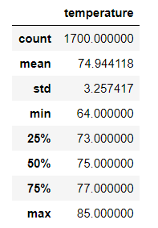
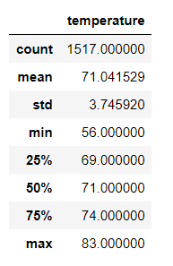
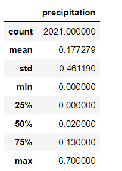

# Surfs_up: How's the weather

As we plan out our business venture in paradise, a surf and ice cream shop, we've been advised to thoroughly look at weather patterns in the island more specifically temperature and percipitation. During this session we reviewed percipitation and all looked normal for a tropical island, like Oahu, HI. There is a visible winter with rain averaging 1 to 2 inches from February to March, and a monsoon season, typical for the Pacific in August and September. Throughout the year there is some percipitation, not too much, just enough to keep the weather warm and the plants green. In reviewing the temperatures for June and December we hope to find a that Oahu is a great place for our surf and ice cream shop. 

## Temperature in Paradise

In reviewing the temperature measurements provided in the "Measurements" table we noticed there are three sets of temparttures for each year, from 2010 to about 2017. The information that we have is partial in the year 2017, it cuts off in August because of the parameters that were origianlly set. Based on the information provided it can be presumed that the weather is stable in the island of Oahu ranging from temperatures in the 70's year round, occassionally maxing in the low to mid 80's. 

### Averages for June 

As evident in the measurements for the month of June, temperature is stable in the 70's throughout the island. Our analysis includes 1700 temps read, averaging at 74 degrees, +/- 3 degrees. Minimum recorded temperature in June over the 7 year span was 64 degrees, and the max was 85.

### Averages for December

December readings are also substantial, dataset is over 1500 measurements spanning the course of 2010 to 2016, enough to feel comfortable that it covers any big changes in climate.  There isn't any, as expected for December in the Northern Hemisphere weather is a little cooler but the weather doesn't cool too much and averages in the low 70's, +/- 3 degrees. High's in the area can reach low 80's which means we can continue to sell ice cream straight into Christmas and with low's scooping into mid 50's we might be able to sell a wet suit or two. This weather would allow us to remain open through the holidays.

### Raining on our data

Unlike our teperature review that spans from 2010 to 2017 the data reviewd for percipitation is only for the year of 2016-2017, but a review of the whole year. We notice that this particular year the island didn't see much in rain except during the monsoon season of 2016 where the island received 6+ inches. Overall an average year, except we would need to review past years to see how normal this is.  Rain shows constant throughout the island in February and March, and little to none during the other months, except for the August/September monsoon season.

## Best choice for Surf's Up

Based on the information available to us we can conclude that Oahu is the good place to open a surf and ice cream shop. The weather is constant, fluctuating very little. It's not as wet, has set rain seasons, making it easy to predict sales and personell needs. Other weather related data that might come is:
    - reviewing at least 2 more years of percipitation to see how weather is trending, although covering a range in 4 years would capture Nin@s effecting rain patterns
    - reviewing other months or a full year of temperature. Reviewing June and December capture times right after exptreme weather such as rain and cold weather, idealic temperatures. But what is it like the rest of the year?
    - I'd also like to see humidity and wind measuremnts as these can increase temperature and waves lengths. Humidity levels can drive weather to feel 10 degrees higher and wind can make better waves and also make the ocean too choppy and bad surfing conditions. These two conditions can effect sales of ice cream and surfing goods.

All these factoring other variable could complete a picture to project the success of Surf's Up.
